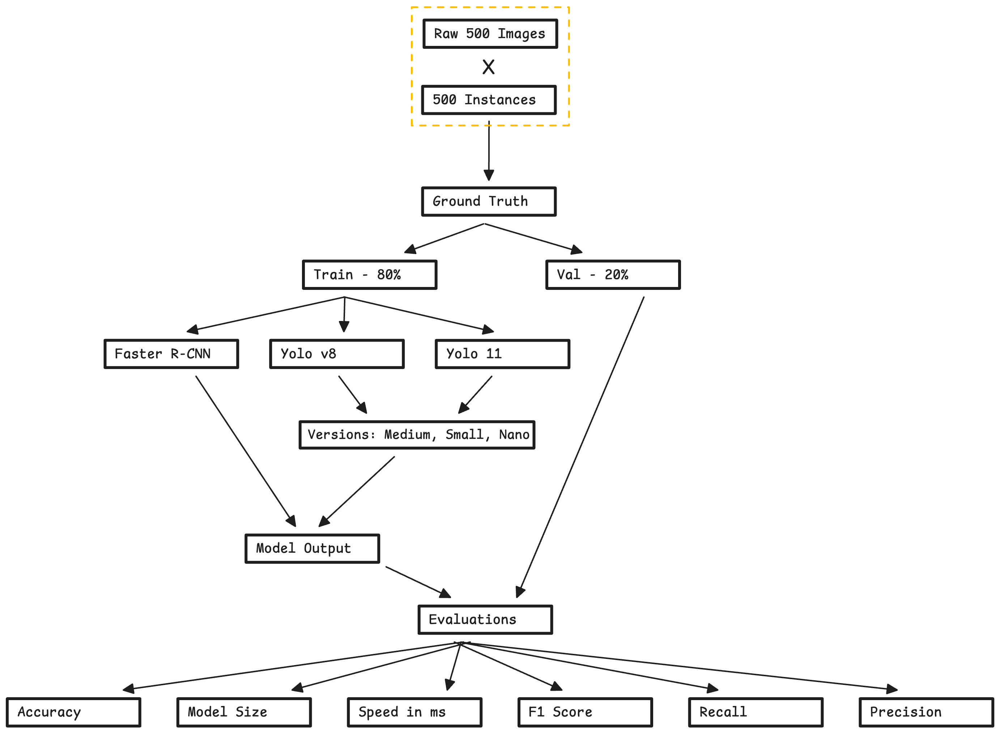

# SURVUE – Object Detection Pipeline (RCNN → YOLO)

## 1. Introduction
This project is part of the **SURVUE** initiative, focused on building an object detection system capable of identifying three categories:  
- **Human**  
- **Traffic Sign**  
- **Vehicle**  

We start with a traditional region-based detector (**RCNN**) to establish a baseline, then move to modern real-time architectures (**YOLO**).  
YOLO models are optimized for speed and accuracy, making them far more suitable for real-world deployment and embedded systems.

---

## 2. High-Level Approach
We begin with **500 raw images** and their corresponding annotations.  
These annotated images form the **ground truth dataset**.

The workflow is straightforward:

1. Combine raw images + annotations → build final labeled dataset  
2. Split data into **80% training** and **20% validation**  
3. Train multiple models (RCNN, YOLO11n/s/m)  
4. Evaluate accuracy, precision, recall, mAP, and inference speed  
5. Compare all models to determine the most efficient architecture for each object category

The goal is to understand how each model behaves under identical data and how changes in architecture affect detection performance.

---

## 3. Project File Structure
| Name                    | Type             | Description                                                                           |
| ----------------------- | ---------------- | ------------------------------------------------------------------------------------- |
| **images/**             | Folder           | Contains the original 500 raw images.                                                 |
| **results/**            | Folder           | Contains the same 500 images but annotated; serves as the ground truth dataset.       |
| **dataset_og/**         | Folder           | Train/val split generated from the fully annotated results folder.                    |
| **dataset_copy/**       | Folder           | Train/val split with traffic-sign annotations removed to improve model accuracy.      |
| **model/**              | Folder           | Holds all YOLO model variants used during training and testing.                       |
| **runs/**               | Folder           | Stores outputs generated by training runs (weights, logs, metrics).                   |
| **annotations.py**      | Python Script    | Applies bounding-box annotations onto raw images.                                     |
| **dataset.py**          | Python Script    | Randomly splits the annotated dataset into 80% train and 20% val.                     |
| **yolo_labels.py**      | Python Script    | Converts annotation data into YOLO-format `.txt` files containing object coordinates. |
| **model_train.py**      | Python Script    | Defines the selected YOLO model and all training hyperparameters.                     |
| **test.py**             | Python Script    | Evaluates the best checkpoint produced by each training run.                          |
| **comparison.py**       | Python Script    | Prints the size of all trained models under different hyperparameters.                |
| **run.ipynb**           | Jupyter Notebook | Orchestrates and executes all Python scripts end-to-end.                              |
| **cpu_inference.ipynb** | Jupyter Notebook | Benchmarks CPU inference time for any trained model.                                  |

---

## 4. Model Summary Table
YOLO models overwhelmingly outperform Faster RCNN across every metric—accuracy, speed, and model size.

Among all experiments we can say that:

* YOLOv8s (No-Traffic-Signs) achieves the highest accuracy (mAP50-95 = 91.9%).

* YOLO11n (960px) gives the fastest CPU inference (43.7 ms) with strong accuracy for its size.

* Quantized YOLOv8n cuts model size nearly in half with minimal accuracy loss.

Removing traffic-sign annotations (“No-TS” datasets) consistently boosts precision and recall for human/vehicle detection.

| Model                   | Image Size | Best Model Size | mAP50 | mAP50-95 | GPU Inference | CPU Inference | Precision | Recall |
| ----------------------- | ---------- | --------------- | ----- | -------- | ------------- | ------------- | --------- | ------ |
| **YOLO11m**             | 960        | 38.67 MB        | 95.5% | 86.9%    | 19.3 ms       | 437.6 ms      | 95.97%    | 90.4%  |
| **YOLO11s**             | 960        | 18.32 MB        | 94.8% | 84.4%    | 6.9 ms        | 166.5 ms      | 95.22%    | 88.78% |
| **YOLO11n**             | 960        | 5.25 MB         | 92.5% | 79.2%    | 5.2 ms        | 43.7 ms       | 92.55%    | 85.38% |
| **YOLO11n**             | 1280       | 5.30 MB         | 96.1% | 85.2%    | 4.9 ms        | 69.9 ms       | 93.1%     | 92.3%  |
| **YOLOv8s (No-TS)**     | 1280       | 21.54 MB        | 98.6% | 91.9%    | 13.7 ms       | 211.3 ms      | 98.3%     | 94.6%  |
| **YOLOv8n**             | 1280       | 6.03 MB         | 96.3% | 84.4%    | 8.3 ms        | 73.3 ms       | 95.3%     | 91.9%  |
| **YOLOv8n (Quantized)** | 1280       | 3.72 MB         | 96.3% | 85.1%    | N/A           | 86.1 ms       | 96.1%     | 91.5%  |
| **YOLOv8n (No-TS)**     | 1280       | 6.03 MB         | 97.7% | 87.5%    | 4.8 ms        | 71.3 ms       | 96.6%     | 93.3%  |
| **Faster RCNN**         | 960        | 41.8 MB         | 77.6% | 69.0%    | -      | -       | 85.3 %        | 79.0 %     |

